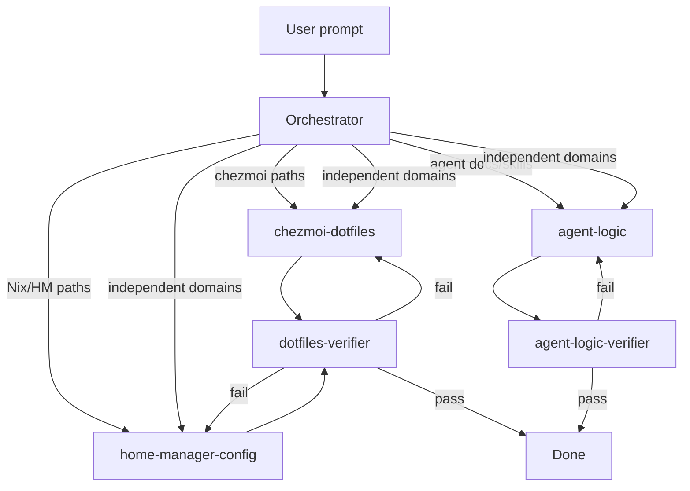

# Orchestration

## Roles

| Role             | Responsibility                                                              |
| ---------------- | --------------------------------------------------------------------------- |
| **Orchestrator** | Plan, route, launch parallel specialists, collect results — never implement |
| **Specialist**   | Implement changes in correct **source** paths (chezmoi, HM, or agent-logic) |
| **Verifier**     | Validate outcome vs request; loop until pass                                |

## Flow



## Parallel execution

Launch independent specialists **concurrently** in a single orchestrator turn when domains do not depend on each other:

- chezmoi + home-manager (e.g. dotfile template + Nix package)
- Multiple unrelated file groups (e.g. ssh config + starship + HM module)
- agent-logic + domain specialist when changes are independent

Orchestrator collects results, then runs verifier(s). Do not serialize work that can run in parallel. Orchestrator must not read or edit implementation files — only route and brief.

## Orchestrator checklist

- [ ] Restate user goal in one sentence
- [ ] List affected **source** paths (not target)
- [ ] Pick specialist(s): chezmoi / home-manager / agent-logic / combinations
- [ ] Decompose into parallel sub-tasks where independent; launch concurrently
- [ ] Note flags (`with-nix-hm`, `VAST.personal`, etc.) if templates depend on them
- [ ] Pass brief(s) to specialist(s) — do not implement in orchestrator

## Handoff brief template

```markdown
## Goal
<one sentence>

## Specialist
chezmoi-dotfiles | home-manager-config | agent-logic | parallel combo

## Source paths
- `chezmoi.roots/_home/...`

## Constraints
- <flags, conventions, scope limits>

## Done when
- <observable outcomes>
```

## Dual-domain tasks

When a change spans chezmoi and HM (e.g. new HM module + chezmoi ignore rule):

1. Launch **chezmoi-dotfiles** and **home-manager-config** in parallel when edits are independent
2. If HM depends on chezmoi source layout, chezmoi first; otherwise parallel
3. dotfiles-verifier — end-to-end check

## Agent-logic tasks

Changes to agent workflow itself (`AGENTS.md`, `docs/agents/`, `.cursor/skills/`, `.cursor/rules/`):

- Route to **agent-logic** specialist
- Verify with **agent-logic-verifier** (`.cursor/skills/agent-logic-verifier/SKILL.md` or `docs/agents/verifier.md` Agent-logic checks)
- Can run in parallel with domain specialists when changes are unrelated

## Tool mapping

| Tool           | Orchestrator                                  | Specialist                     | Verifier                                            |
| -------------- | --------------------------------------------- | ------------------------------ | --------------------------------------------------- |
| Cursor         | Parent agent or `dotfiles-orchestrator` skill | `Task` subagent + domain skill | `dotfiles-verifier` or `agent-logic-verifier` skill |
| Claude Code    | Main thread plans                             | Subagent or sequential role    | Separate verification pass                          |
| Codex / others | Follow AGENTS.md manually                     | Read `docs/agents/<domain>.md` | Read `docs/agents/verifier.md`                      |

**Invariant:** Verifier always runs after specialist. Never skip verification on non-trivial tasks.

## Trivial tasks (orchestrator may skip formal sub-agents)

- Single-file doc typo
- Pure Q&A with no edits

Still use correct source/target terminology.
