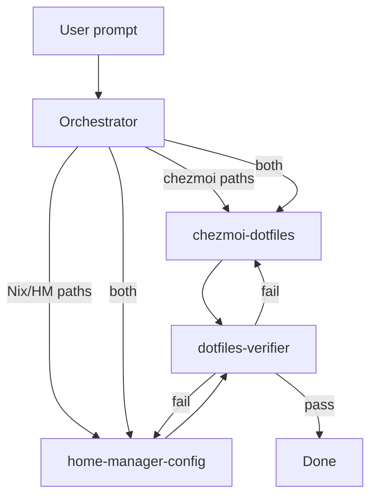

# Orchestration

## Roles

| Role             | Responsibility                                            |
| ---------------- | --------------------------------------------------------- |
| **Orchestrator** | Parse request, route to specialist, produce handoff brief |
| **Specialist**   | Implement changes in correct **source** paths             |
| **Verifier**     | Validate outcome vs request; loop until pass              |

## Flow



## Orchestrator checklist

- [ ] Restate user goal in one sentence
- [ ] List affected **source** paths (not target)
- [ ] Pick specialist: chezmoi / home-manager / both (sequential: chezmoi first if HM files are chezmoi-deployed)
- [ ] Note flags (`with-nix-hm`, `VAST.personal`, etc.) if templates depend on them
- [ ] Pass brief to specialist — do not implement yet

## Handoff brief template

```markdown
## Goal
<one sentence>

## Specialist
chezmoi-dotfiles | home-manager-config | both

## Source paths
- `chezmoi.roots/_home/...`

## Constraints
- <flags, conventions, scope limits>

## Done when
- <observable outcomes>
```

## Dual-domain tasks

When a change spans chezmoi and HM (e.g. new HM module + chezmoi ignore rule):

1. chezmoi-dotfiles — source file changes, templates, ignore
2. home-manager-config — Nix modules, flake, host enables
3. dotfiles-verifier — end-to-end check

## Tool mapping

| Tool           | Orchestrator                                  | Specialist                     | Verifier                                    |
| -------------- | --------------------------------------------- | ------------------------------ | ------------------------------------------- |
| Cursor         | Parent agent or `dotfiles-orchestrator` skill | `Task` subagent + domain skill | `Task` subagent + `dotfiles-verifier` skill |
| Claude Code    | Main thread plans                             | Subagent or sequential role    | Separate verification pass                  |
| Codex / others | Follow AGENTS.md manually                     | Read `docs/agents/<domain>.md` | Read `docs/agents/verifier.md`              |

**Invariant:** Verifier always runs after specialist. Never skip verification on non-trivial tasks.

## Trivial tasks (orchestrator may skip formal sub-agents)

- Single-file doc typo
- Pure Q&A with no edits

Still use correct source/target terminology.
